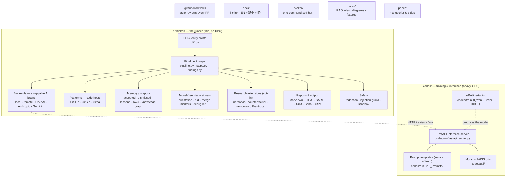

# prthinker

**English** · [繁體中文](READMEs/README.zh-TW.md) · [简体中文](READMEs/README.zh-CN.md)

📖 **Documentation:** <https://code-review-framework.readthedocs.io/en/latest/>

> A Chain-of-Thought code review framework for GitHub PRs, backed by a
> fine-tuned Qwen3-Coder model with retrieval-augmented prompting.

`prthinker` reads a Pull Request diff, runs a five-step Chain-of-Thought
review, and posts a structured summary plus one-click `suggestion` blocks
back to the PR. It learns from each repo's history — dismissed comments
are filtered out next time, accepted suggestions are surfaced as in-context
exemplars — and can act as a required status check before merges.

## In plain language

Never touched the code? Here is the whole idea in a few sentences:

- **What it does** — When a developer opens a Pull Request (a proposed
  code change), `prthinker` reads the change and reviews it the way a
  careful senior engineer would: it summarises what changed, points out
  bugs and risky spots, flags style and design problems, and leaves
  comments right on the affected lines — many with a one-click
  "apply this fix" button.
- **It learns your team's taste** — Comments your team dismisses, it
  stops repeating. Suggestions your team accepts, it reuses as examples
  next time.
- **It can guard the merge button** — You can require it as a check, so
  a Pull Request can't be merged while serious problems remain.
- **Two halves** — A lightweight **runner** does the talking to GitHub
  and needs no special hardware; a heavier **AI "brain"** (the language
  model) runs separately on a GPU server, or via a paid API such as
  OpenAI / Anthropic. The [Project structure](#project-structure)
  diagram below shows how the pieces fit.

Think of it as an always-available reviewer that never gets tired,
remembers past feedback, and explains its reasoning step by step.

## What you get

- **Five-step CoT pipeline** — first_summary → first_code_review → linter →
  code_smell → total_summary, plus an optional per-file inline-findings
  step that emits structured JSON.
- **Per-file inline review** with GitHub `suggestion` blocks that PR
  authors can apply with one click.
- **RAG over global rules + per-repo `--rules-dir`** for team-specific
  coding standards.
- **Two learned corpora**: `dismissed.jsonl` (filters repeats), `accepted.jsonl`
  (top-K exemplars injected into the prompt).
- **CI failure signals**: failed-job tail logs are prepended to the diff so
  the reviewer can correlate findings with observed test failures.
- **Pre-merge Check Run gate** — block merges when error-severity findings
  exist, wire into branch protection.
- **Pluggable backends**: in-process local Hugging Face causal-LM
  (Qwen / Llama / Mistral / CodeLlama, …) with optional LoRA +
  quantization; the project's own FastAPI inference server; any
  OpenAI-Chat-Completions endpoint (OpenAI, Azure OpenAI, vLLM,
  Ollama `/v1`, LM Studio, Together, Groq, DeepInfra, OpenRouter, …);
  Anthropic Claude (Messages API); or Gemini / Cohere / Mistral.
  `RouterBackend` (failover) and `EnsembleBackend` (voting) compose any
  of these.
- **Cost + latency telemetry** — SQLite-backed prompt cache (`--cache`)
  with content-hash invalidation, plus per-call telemetry (`--telemetry`)
  that records tokens, latency, cache-hit status and estimated USD cost.
  `prthinker stats` aggregates by backend / model.
- **`.prthinker.yaml` repo-level config** — pin backend, gate threshold,
  cache + telemetry, per-repo rules in one PR-reviewable file. Secrets
  always come from env vars, never the YAML.
- **Secret redaction** — `--redact-secrets` scrubs AWS / GitHub / OpenAI
  / Anthropic / Stripe / Slack / JWT / PEM keys from the diff before any
  paid backend call. Idempotent, cache-friendly, never logs content.
- **Reviewer orientation signals** — thirteen no-model checks render
  below every PR digest (and run standalone via `prthinker triage`):
  Trojan-Source bidi/invisible characters, leftover merge-conflict
  markers, renames/moves, deletions, file-mode/exec-bit changes,
  lockfile/vendored/minified noise, formatting-only churn, binary
  changes, large pasted blocks, test-coverage gaps, new TODO/FIXME
  markers, leftover debug statements, and swallowed `except: pass`.
- **`prthinker triage`** — run every orientation signal over a diff with
  **no backend** (instant, GPU-free): `git diff | prthinker triage`, or
  `--staged` / `--against REF`. `--exit-nonzero-on-signal` makes it a
  cheap pre-merge gate; reuse from CI before scheduling a full review.
- **MCP server** — `prthinker mcp` exposes the pipeline as a Model
  Context Protocol stdio server so Claude Desktop, Cursor, Continue,
  Cline, and Zed can run reviews from inside the IDE. Tools: `review_diff`
  (full CoT review), `triage_diff` (model-free signals), and `stats`.

### Research-grade extensions (opt-in)

Seventeen mechanisms most LLM-code-review systems do not ship. Most
require `--inline-review`; per the project's no-fabrication rule we
publish the framework only — measured benchmark numbers are future
work.

- **Adversarial robustness** (`prthinker adversarial-eval`) — runs a
  prompt-injection corpus across four attack families and records
  every per-call outcome to SQLite. The bundled `seed.jsonl` is a
  seed, **not** a benchmark.
- **Closed-loop multi-turn dialogue** (`--reply-to-author`) — injects
  the PR author's replies to the last prthinker comment as *Prior
  dialogue* so the next review drops, refines, or rebuts findings the
  author already addressed.
- **Counterfactual review** (`--counterfactual`) — for design-choice
  findings, surfaces competing implementations and a trade-off matrix
  instead of one "do X".
- **Provenance / audit trail** (`--provenance`) — every finding cites
  the RAG rule, accepted-example, or diff line(s) that informed it,
  with optional self-confidence in [0, 1].
- **Force-push differential** (`--diff-since-last`) — hashes each
  file's new-side content and reuses cached findings for unchanged
  files between pushes on the same PR. Saves token cost on iterative
  PRs.
- **Suggestion sandbox** (`--verify-suggestions`) — clones the
  workdir, applies each suggestion in a sandbox, runs `--verify-cmd`,
  and badges each one `[verified]` / `[FAILED]` / `[skipped]` /
  `[error]`. Original repo never mutated.
- **Cross-language API drift** (`--api-consistency`) — when the PR
  touches both backend `.py` and frontend `.ts` / `.tsx` files, an
  extra step flags request/response shape drift across the two sides.
- **PR-type adaptive review** (`--pr-classify`) — classifies the PR
  (bugfix / feature / refactor / docs / chore / unknown) from the
  diff + title + body, then adapts review depth and focus. Docs PRs
  skip inline findings; bugfix PRs get a focused prompt.
- **Reproducibility signal** (`--reproducibility-check`) — runs the
  inline-findings step twice per file and labels each finding
  `[stable]` / `[low-reproducibility]`. Backend-agnostic uncertainty
  proxy.
- **Dependency upgrade impact** (`--dep-upgrade-check`) — detects
  lock-file touches (`requirements.txt` / `pyproject.toml` /
  `package.json`), extracts version deltas, and asks the model
  whether breaking changes affect this codebase's actual usage.
- **Reviewer personas + conflict surfacing** (`--personas`) — runs N
  orthogonal lenses (security / performance / readability /
  api_stability / maintainability) and a conflict-finder step
  surfaces where they disagree.
- **Risk-weighted attention** (`--risk-weighted`) — per-file score
  from churn + complexity + bug history (via `git log`); scales the
  findings budget proportional to risk.
- **Diff entropy / "diff bomb" detector** (`--diff-entropy`) — scores
  the PR's size + dispersion entropy; high-entropy PRs get a
  "Consider splitting this PR" warning at the top of the comment.
- **Active-learning derived lessons** (`derive-lessons` + `--lessons`) —
  distils the dismissed / accepted corpora into reusable rules and
  injects the most recent top-K into the next review.
- **Cross-PR finding clustering** (`discover-rules`) — greedy cosine
  clustering over accumulated findings surfaces recurring issues as
  candidate project rules.
- **Repo knowledge graph** (`build-kg` + `--kg-ground`) — persists repo
  symbols to SQLite and grounds findings so the model cites real
  symbols, not hallucinated ones; ships a D3 visualization served
  per-repo at `/kg/<name>/`.
- **Incremental per-file save** (`--incremental-save-dir`) — atomic
  per-file result writes so a cancelled or crashed run still leaves
  readable partial results.

**Operability & output integrations** (opt-in, runner-safe): SARIF and
standalone HTML reports, finding suppression (`.prthinkerignore`) and
de-duplication, public-API / semver impact, a Gitea platform adapter,
commit-message review, extra HTTP backends (Gemini / Cohere / Mistral)
with `RouterBackend` failover and `EnsembleBackend` voting,
self-consistency sampling, third-party step plugins, confidence-based
abstention, citation verification, a prompt-injection guard, finding
localization, golden-set snapshots, an evaluation-harness skeleton, cost
estimation + budget, and focused review modes (security / performance /
test-coverage / IaC / DB-migration / accessibility / secret-scan / PII).

See [`docs/en/concepts/research-extensions.rst`](docs/en/concepts/research-extensions.rst)
for the design write-up.

## Quickstart

```bash
# Editable install with just the runner deps (no torch/transformers)
pip install -e ".[runner]"

# Review a local diff against a remote inference server
prthinker review-file my-change.diff \
    --backend remote \
    --remote-url http://my-host:9000 \
    --per-file --inline-review

# Review a PR end-to-end (used by the GitHub Action)
prthinker review-pr \
    --repo owner/name --pr-number 42 \
    --backend remote --remote-url http://my-host:9000 \
    --gate-on error --include-ci-signals

# …or use OpenAI / Azure / vLLM / Ollama via the OpenAI-compat backend
prthinker review-pr --repo o/r --pr-number 42 \
    --backend openai \
    --openai-base-url http://localhost:11434/v1 \
    --openai-model llama3.1:8b \
    --openai-api-key ollama

# …or use Anthropic Claude
prthinker review-pr --repo o/r --pr-number 42 \
    --backend anthropic \
    --anthropic-model claude-sonnet-4-6 \
    --anthropic-api-key "$ANTHROPIC_API_KEY"

# …or turn on every research-grade extension at once
prthinker review-pr --repo o/r --pr-number 42 \
    --per-file --inline-review \
    --reply-to-author --counterfactual --provenance \
    --diff-since-last --verify-suggestions --api-consistency \
    --pr-classify --reproducibility-check --dep-upgrade-check \
    --personas all --risk-weighted --diff-entropy \
    --judge --self-correct

# Stress-test backend robustness against prompt-injection patterns
prthinker adversarial-eval \
    --corpus prthinker/adversarial_corpus/seed.jsonl \
    --outcomes-path .prthinker/adversarial.sqlite \
    --backend openai --openai-model gpt-4o-mini

# Model-free static triage — no backend, instant, GPU-free
git diff origin/main | prthinker triage
prthinker triage --staged --exit-nonzero-on-signal   # cheap pre-merge gate
```

To deploy the inference server (requires a GPU and the heavier extras):

```bash
pip install -e ".[server]"
uvicorn codes.run.fastapi_server:app --host 0.0.0.0 --port 9000
```

Or use the `docker/` compose bundle. Base deploy publishes the FastAPI
server on `:9000`; two optional overlays stack on top:

```bash
cd docker && cp .env.example .env
docker compose up -d                                                  # :9000
docker compose -f docker-compose.yml -f docker-compose.tls.yml up -d        # +TLS+token :443
docker compose -f docker-compose.yml -f docker-compose.monitoring.yml up -d # +dashboards :9000
```

The monitoring overlay routes everything under host `:9000` by path —
`/grafana/` (Grafana, `admin`/`admin` by default), `/prometheus/`,
`/cadvisor/`, and `/kg/` (repo knowledge-graph page) — with prthinker
serving every other path. Full reference (files, volumes, routed URLs):
[`docs/en/concepts/docker-platforms-report.rst`](docs/en/concepts/docker-platforms-report.rst).

## GitHub Actions

Copy `.github/workflows/prthinker.yml`, then set two repo secrets:

| Secret               | Purpose                                |
| -------------------- | -------------------------------------- |
| `PRTHINKER_BACKEND_URL`    | Base URL of your FastAPI server        |
| `PRTHINKER_BACKEND_API_KEY`| Bearer token (optional)                |

The workflow fires on `pull_request` opened/synchronize/reopened and
runs three jobs: `enumerate` lists files (after filtering noise via
`PRTHINKER_EXCLUDE_GLOBS`), `review` is a matrix that gives each file
its own runner + 60-minute timeout, and `aggregate` merges every
runner's partial JSON into a single summary comment + one inline
review + one gate close. The runner-server transport uses
`POST /review/submit` + `GET /review/result/{id}` polling so the
workflow stays within any reverse-proxy idle timeout (Cloudflare's
100 s cap, for example).

A cancelled workflow stops burning GPU: the runner posts
`POST /review/cancel/{id}` on its way out and the backend's idle
sweeper sets the cancel flag on any job that hasn't been polled for
180 s. The aggregator finishes with a `### Overall Summary` it
synthesises across every file via `POST /ask/submit`, and every
re-run on the same SHA deduplicates its predecessor: the summary
comment is upserted in place, prior inline reviews have their
child comments deleted, and prior `prthinker` check runs are PATCHed
to `neutral` with a *superseded* title. See
[`docs/en/guide/github-actions.rst`](docs/en/guide/github-actions.rst)
for the full architecture.

## Documentation

- **[`setup.md`](READMEs/setup.md)** — comprehensive setup walkthrough (six
  scenarios, every env var, troubleshooting).
- **[`features.md`](READMEs/features.md)** — full feature catalog.
- **[`docs/`](docs/)** — Read-the-Docs-style deep-dives (English +
  Traditional + Simplified Chinese).

Full documentation is published on Read the Docs at
**<https://code-review-framework.readthedocs.io/en/latest/>** (source in
[`docs/`](docs/)):

- **Guide** — installation, quickstart, configuration, GitHub Actions
- **Concepts** — architecture, pipeline, RAG, corpora, CI signals, the gate
- **Reference** — CLI, HTTP API, Python API

To build the docs locally:

```bash
pip install -r docs/requirements.txt
sphinx-build -b html docs docs/_build/html
```

## Project structure

The repository has **two halves**: a lightweight **runner** (`prthinker/`
— reads a PR, runs the review, posts results, no GPU needed) and a
heavier **training + inference** side (`codes/` — runs the AI model on a
GPU). Everything else (`docs/`, `docker/`, `datas/`, `paper/`, `tests/`,
the GitHub Action) supports those two.



**Annotated layout:**

```text
Code-Review-Framework/
├── prthinker/            # THE RUNNER — reads a PR, reviews it, posts results (no GPU)
│   ├── cli*.py           #   Command-line entry points (review-pr, review-file, triage…)
│   ├── pipeline.py       #   The step-by-step review engine …
│   ├── steps.py          #   … and the individual review steps
│   ├── backends/         #   Swappable "AI brains": local model, your server, OpenAI, Anthropic, Gemini…
│   ├── platforms/        #   Swappable code hosts: GitHub, GitLab, Gitea
│   ├── prompts/          #   Bundled copy of the review prompt templates (kept in sync with codes/)
│   ├── review_modes/     #   Focused passes: security, performance, PII, IaC, accessibility…
│   ├── accepted.py       #   Memory: suggestions the team accepted (reused as examples)
│   ├── dismissed.py      #   Memory: comments the team rejected (filtered out next time)
│   ├── *_report.py       #   Output formats: Markdown, HTML, SARIF, JUnit, Sonar, CSV
│   ├── redaction.py      #   Safety: scrub secrets before any external API call
│   ├── injection_guard.py#   Safety: block prompt-injection attacks hidden in diffs
│   └── (orientation, personas, risk_score, counterfactual, …)  # Signals + research extensions
├── codes/                # THE AI BRAIN — training + the inference server (needs a GPU)
│   ├── run/fastapi_server.py  #   The model server the runner talks to
│   ├── run/CoT_Prompts/       #   Prompt templates (single source of truth)
│   ├── train/                 #   Fine-tuning scripts (Qwen3-Coder-30B, Qwen3-30B, Qwen2.5-7B…)
│   └── util/                  #   Model loading + FAISS retrieval
├── docs/                 # This documentation (English + 繁體中文 + 简体中文), built with Sphinx
├── docker/               # One-command self-hosting (base + optional TLS + monitoring)
├── datas/                # Rule documents for RAG, architecture diagrams, test fixtures
├── paper/                # The academic manuscript and slides
├── tests/                # Automated tests
└── .github/workflows/    # The GitHub Action that reviews every PR automatically
```

For the design-pattern view (Strategy / Factory / Registry / Repository)
and the runtime data-flow diagrams, see
[`READMEs/architecture.md`](READMEs/architecture.md) and
[`docs/en/concepts/architecture.rst`](docs/en/concepts/architecture.rst).

## Citation

If you use this framework in academic work, please cite the underlying paper
(`paper/`). The Read the Docs site links to the manuscript.

## License

See [LICENSE](LICENSE).