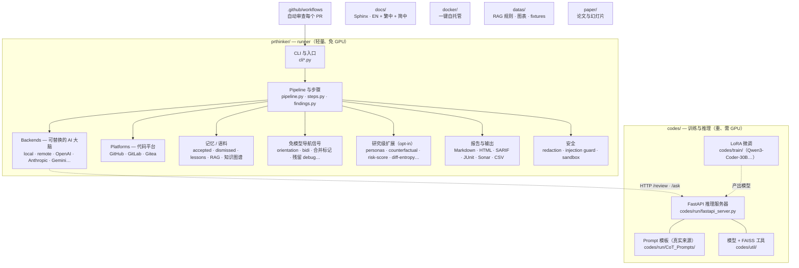

# prthinker

[English](../README.md) · [繁體中文](README.zh-TW.md) · **简体中文**

📖 **在线文档：** <https://code-review-framework.readthedocs.io/en/latest/>

> 为 GitHub Pull Request 设计的思维链（Chain-of-Thought）代码审查框架，
> 底层由微调后的 Qwen3-Coder 模型加上检索增强（RAG）提示驱动。

`prthinker` 会读取 PR diff、执行五步思维链审查、把结构化的总结与一键应用的
`suggestion` 区块回帖到 PR。它会从每个 repo 的历史中学习──被 PR 作者拒绝的评论
下次会被过滤掉，被采纳的建议会以示例（exemplar）的形式注入下一轮 prompt──
并且可以作为合并前的必需状态检查。

## 一句话说明（给所有人）

没碰过代码也没关系，整个概念用几句话就能讲完：

- **它做什么**──当开发者开出一个 Pull Request（提议的代码变更）时，
  `prthinker` 会像一位细心的资深工程师那样审查：总结这次改了什么、指出
  bug 与风险点、标出风格与设计问题，并把评论直接贴在受影响的行上──
  其中许多还附带一键「应用此修复」按钮。
- **它会学你们团队的口味**──团队拒绝过的评论，它不再重复；团队采纳过的
  建议，下次会被当成示例重用。
- **它能守住合并按钮**──你可以把它设成必需检查，让 Pull Request 在严重
  问题尚未解决前无法被合并。
- **两个半边**──轻量的 **runner** 负责跟 GitHub 对话、不需要特殊硬件；
  较重的 **AI「大脑」**（语言模型）则跑在另一台 GPU 服务器上，或通过
  OpenAI / Anthropic 之类的付费 API。下方 [仓库结构](#仓库结构) 的图
  说明各部分如何衔接。

可以把它想成一位随时待命、永不疲倦、记得过往反馈、并且会一步步说明推理
过程的审查员。

## 你会得到什么

- **五步 CoT pipeline**──`first_summary` → `first_code_review` → `linter` →
  `code_smell` → `total_summary`，外加可选的逐文件 inline-findings 步骤，
  输出结构化 JSON。
- **逐文件 inline review**，配合 GitHub `suggestion` 区块，PR 作者点一下
  即可应用。
- **全局规则 + 各 repo 规则包**：通过 `--rules-dir` 把团队自定的 markdown
  规则加进 prompt。
- **两份学习语料**：`dismissed.jsonl`（用相似度过滤掉重复命中）、
  `accepted.jsonl`（把 top-K 采纳过的示例注入 prompt）。
- **CI 失败信号**：把失败 job 的末端日志前置到 diff，让 reviewer 能对齐
  flagged 行与实际的测试失败。
- **合并前 Check Run gate**：当出现 error 严重度的 finding 时让 Check Run
  变成 failure，可在 branch protection 设为必需检查。
- **可替换的 backend**：四种任你挑──本地 in-process Hugging Face
  causal-LM（Qwen、Llama、Mistral、CodeLlama …，支持 LoRA + 量化）、
  自部署 FastAPI 推理服务器、任何 OpenAI-Chat-Completions 兼容端点
  （OpenAI、Azure、vLLM、Ollama `/v1`、LM Studio、Together、Groq、
  DeepInfra、OpenRouter …）、Anthropic Claude Messages API、或
  Gemini / Cohere / Mistral；`RouterBackend`（故障转移）与
  `EnsembleBackend`（表决）可组合上述任一后端。

### 研究级扩展（opt-in）

十七个多数 LLM code review 系统未实作的机制。大多需搭配 `--inline-review`；
依本项目不臆造原则，我们只交付框架，量化 benchmark 数字属于未来工作。

- **对抗鲁棒性**（`prthinker adversarial-eval`）──针对四种攻击类型跑
  prompt-injection 语料，把每一笔调用结果写入 SQLite。随附之
  `seed.jsonl` 是种子语料，**不是** benchmark。
- **闭环多轮对话**（`--reply-to-author`）──读取 PR 作者对上次 prthinker
  摘要评论之回复，注入为 *Prior dialogue* 区块。
- **反事实审查**（`--counterfactual`）──针对属于 *设计选择* 之 finding，
  列出竞争性实现方案与小型 trade-off 矩阵。
- **评论来源 / 引用审计**（`--provenance`）──每条 finding 附上 `provenance`
  payload，标注引用了哪一条 RAG 规则 / accepted-example / diff 行号。
- **Force-push 差分**（`--diff-since-last`）──把每文件新侧内容 hash，
  同一 PR 之下次 push 时未动的文件直接 reuse 上次 findings。
- **建议 sandbox 验证**（`--verify-suggestions`）──把 working tree 复制到
  disposable sandbox 套用 suggestion 后跑 `--verify-cmd`，每条建议标
  `[verified]` / `[FAILED]` / `[skipped]` / `[error]`。原 repo 绝不动。
- **跨语言 API 一致性**（`--api-consistency`）──当 PR 同时碰到后端 `.py`
  与前端 `.ts` / `.tsx`，新增一个 step 检测两侧 request/response 形状漂移。
- **PR 类型自适应**（`--pr-classify`）──从 diff + 标题 + body 把 PR 分为
  bugfix / feature / refactor / docs / chore / unknown，后续 review 深度
  随之调整。
- **评论一致性信号**（`--reproducibility-check`）──同 prompt 跑两次 inline-findings，
  把 finding 标 `[stable]` / `[low-reproducibility]`。
- **依赖升级影响**（`--dep-upgrade-check`）──检测 lock-file 触碰，
  抽出版本 delta，问模型 breaking change 是否影响本 repo 之实际用法。
- **多角色 + 冲突显化**（`--personas`）──跑 N 个正交 lens（security /
  performance / readability / api_stability / maintainability），
  conflict-finder step 把它们的分歧显化出来。
- **风险加权注意力**（`--risk-weighted`）──以 churn + complexity + bug
  history（从 `git log` 抓）算每文件风险分，按比例缩放 finding budget。
- **Diff 熵 /「Diff bomb」检测**（`--diff-entropy`）──算 PR size +
  目录分布 Shannon entropy；熵高时于评论顶端贴「Consider splitting this PR」警示。
- **主动学习衍生规则**（`derive-lessons` + `--lessons`）──把 dismissed /
  accepted 语料蒸馏为可重用规则，下次审查注入最近 top-K。
- **跨 PR finding 聚类**（`discover-rules`）──对累积 finding 跑贪婪
  cosine 聚类，把重复问题显化为候选项目规则。
- **Repo 知识图谱**（`build-kg` + `--kg-ground`）──把 repo 符号持久化至
  SQLite 并接地，使模型引用真实符号而非臆造；附 D3 可视化，于
  `/kg/<name>/` 逐仓服务。
- **每文件递增存档**（`--incremental-save-dir`）──逐文件 atomic 写盘，run
  中断／崩溃仍留下可读之部分结果。

**可操作性与输出整合**（opt-in、runner-safe）：SARIF 与独立 HTML 报告、
finding 抑制（`.prthinkerignore`）与去重、公开 API / semver 影响、Gitea
平台适配器、commit message 审查、额外 HTTP 后端（Gemini / Cohere /
Mistral）含 `RouterBackend` 故障转移与 `EnsembleBackend` 表决、
self-consistency 采样、第三方 step 插件、confidence 弃权、引用验证、
prompt-injection 防护、finding 本地化、golden-set 快照、评估 harness
骨架、成本估算与预算，以及聚焦审查模式（security / performance /
test-coverage / IaC / DB-migration / accessibility / secret-scan / PII）。

**审查导航信号（无需模型）**：十三个纯函数检查呈现于每条 PR 摘要下方，
亦可通过 `prthinker triage`（无 backend、瞬间、GPU-free）或 MCP `triage_diff`
工具独立执行──Trojan-Source 双向／不可见字符、残留合并冲突标记、重命名／
移动、删除、mode／执行位变更、lockfile／vendored／minified 噪声、纯格式变更、
二进制变更、大段粘贴、覆盖缺口、新增 TODO/FIXME 标记、残留 debug 语句、
吞错 `except: pass`。

设计细节见 [`docs/zh-CN/concepts/research-extensions.rst`](../docs/zh-CN/concepts/research-extensions.rst)。

## 快速开始

```bash
# 只装 runner 所需依赖，不需要 torch / transformers
pip install -e ".[runner]"

# 对本地 diff 跑审查（指向远程推理服务器）
prthinker review-file my-change.diff \
    --backend remote \
    --remote-url http://my-host:9000 \
    --per-file --inline-review

# 完整审查 PR（GitHub Action 内部用的就是这个）
prthinker review-pr \
    --repo owner/name --pr-number 42 \
    --backend remote --remote-url http://my-host:9000 \
    --gate-on error --include-ci-signals

# …或通过 OpenAI-compat backend 使用 OpenAI / Azure / vLLM / Ollama
prthinker review-pr --repo o/r --pr-number 42 \
    --backend openai \
    --openai-base-url http://localhost:11434/v1 \
    --openai-model llama3.1:8b \
    --openai-api-key ollama

# …或使用 Anthropic Claude
prthinker review-pr --repo o/r --pr-number 42 \
    --backend anthropic \
    --anthropic-model claude-sonnet-4-6 \
    --anthropic-api-key "$ANTHROPIC_API_KEY"

# …或一次开启所有研究级扩展
prthinker review-pr --repo o/r --pr-number 42 \
    --per-file --inline-review \
    --reply-to-author --counterfactual --provenance \
    --diff-since-last --verify-suggestions --api-consistency \
    --pr-classify --reproducibility-check --dep-upgrade-check \
    --personas all --risk-weighted --diff-entropy \
    --judge --self-correct

# 对 backend 做 prompt-injection 鲁棒性压测
prthinker adversarial-eval \
    --corpus prthinker/adversarial_corpus/seed.jsonl \
    --outcomes-path .prthinker/adversarial.sqlite \
    --backend openai --openai-model gpt-4o-mini

# 无需模型的静态 triage──不启动 backend、瞬间、GPU-free
git diff origin/main | prthinker triage
prthinker triage --staged --exit-nonzero-on-signal   # 便宜的合并前 gate
```

部署推理服务器（需要 GPU 与较重的依赖）：

```bash
pip install -e ".[server]"
uvicorn codes.run.fastapi_server:app --host 0.0.0.0 --port 9000
```

或使用 `docker/` compose bundle。base 部署把 FastAPI 服务器 expose 在
`:9000`；其上可再叠两个可选 overlay：

```bash
cd docker && cp .env.example .env
docker compose up -d                                                  # :9000
docker compose -f docker-compose.yml -f docker-compose.tls.yml up -d        # +TLS+token :443
docker compose -f docker-compose.yml -f docker-compose.monitoring.yml up -d # +仪表板 :9000
```

monitoring overlay 把所有东西依路径收在 host `:9000` 之下——`/grafana/`
（Grafana，默认 `admin`/`admin`）、`/prometheus/`、`/cadvisor/`、`/kg/`
（repo knowledge-graph 页），其余路径一律由 prthinker 提供。完整参考
（文件、volume、路由 URL）：
[`docs/zh-CN/concepts/docker-platforms-report.rst`](../docs/zh-CN/concepts/docker-platforms-report.rst)。

## GitHub Actions

复制 `.github/workflows/prthinker.yml`，然后在 repo 设置两个 secrets：

| Secret               | 用途                                |
| -------------------- | ----------------------------------- |
| `PRTHINKER_BACKEND_URL`    | FastAPI 推理服务器的基础 URL        |
| `PRTHINKER_BACKEND_API_KEY`| Bearer token（可选）                |

workflow 在 `pull_request` opened / synchronize / reopened 时触发，
跑三个 job：`enumerate` 列出 files（依 `PRTHINKER_EXCLUDE_GLOBS` 过滤
noise），`review` 是个 matrix──每个 file 各自一个 runner + 60 分钟
timeout，`aggregate` 合所有 partial JSON 为单一 summary comment +
一个 inline review + 开关 gate 各一次。Runner ↔ server 走
`POST /review/submit` + `GET /review/result/{id}` 轮询，所以即使
反向 proxy 有短 idle timeout（如 Cloudflare 100 秒）也不会撞墙。

Workflow 被取消时不会继续烧 GPU──runner 离开前会 post
`POST /review/cancel/{id}`\ ；backend 的 idle sweeper 也会把 180 秒
没被 poll 的 job 自动设成 cancel。Aggregate 之 PR-wide
`### Overall Summary` 通过 `POST /ask/submit` 跨 file 合成。
对同一 SHA 重复 run 不会累积：summary comment 就地 upsert、旧
inline review 的 child comments 全部删掉、旧 `prthinker` check
PATCH 成 *superseded* 灰色状态。完整架构见
[`docs/zh-CN/guide/github-actions.rst`](../docs/zh-CN/guide/github-actions.rst)。

## 文档

- **[`setup.zh-CN.md`](setup.zh-CN.md)** — 完整设置指南（六种场景、
  所有 env var、疑难排查）。
- **[`features.zh-CN.md`](features.zh-CN.md)** — 完整功能总览。
- **[`docs/zh-CN/`](../docs/zh-CN/)** — Read-the-Docs 风格深度章节。

完整文档发布于 Read the Docs：
**<https://code-review-framework.readthedocs.io/en/latest/>**（源码在
[`docs/`](../docs/)），三种语言并行维护：

- `docs/`（英文，主版本）
- `docs/zh-TW/`（繁体中文）
- `docs/zh-CN/`（简体中文）

每个版本包含：

- **Guide**──安装、快速开始、配置、GitHub Actions
- **Concepts**──架构、pipeline、RAG、语料库、CI 信号与 gate
- **Reference**──CLI、HTTP API、Python API

本地构建文档：

```bash
pip install -r docs/requirements.txt
py -m sphinx -b html docs docs/_build/html
```

## 仓库结构

整个 repo 分成**两个半边**：轻量的 **runner**（`prthinker/`──读取 PR、
执行审查、回帖结果，不需要 GPU）与较重的 **训练 + 推理** 侧（`codes/`──
在 GPU 上跑 AI 模型）。其余目录（`docs/`、`docker/`、`datas/`、`paper/`、
`tests/`、GitHub Action）都是支撑这两者。



**逐目录说明：**

```text
Code-Review-Framework/
├── prthinker/            # RUNNER — 读 PR、做审查、回帖结果（免 GPU）
│   ├── cli*.py           #   命令行入口（review-pr、review-file、triage…）
│   ├── pipeline.py       #   一步步的审查引擎 …
│   ├── steps.py          #   … 与各个审查步骤
│   ├── backends/         #   可替换的「AI 大脑」：本机模型、自托管服务器、OpenAI、Anthropic、Gemini…
│   ├── platforms/        #   可替换的代码平台：GitHub、GitLab、Gitea
│   ├── prompts/          #   随包捆绑的审查 prompt 模板（与 codes/ 保持同步）
│   ├── review_modes/     #   聚焦审查：security、performance、PII、IaC、accessibility…
│   ├── accepted.py       #   记忆：团队采纳过的建议（重用为示例）
│   ├── dismissed.py      #   记忆：团队拒绝过的评论（下次过滤掉）
│   ├── *_report.py       #   输出格式：Markdown、HTML、SARIF、JUnit、Sonar、CSV
│   ├── redaction.py      #   安全：调用外部 API 前先擦掉密钥
│   ├── injection_guard.py#   安全：拦截藏在 diff 里的 prompt-injection 攻击
│   └──（orientation、personas、risk_score、counterfactual…）  # 信号 + 研究级扩展
├── codes/                # AI 大脑 — 训练 + 推理服务器（需要 GPU）
│   ├── run/fastapi_server.py  #   runner 调用的模型服务器
│   ├── run/CoT_Prompts/       #   Prompt 模板（单一真实来源）
│   ├── train/                 #   微调脚本（Qwen3-Coder-30B、Qwen3-30B、Qwen2.5-7B…）
│   └── util/                  #   模型加载 + FAISS 检索
├── docs/                 # 本文档（英文 + 繁体中文 + 简体中文），以 Sphinx 构建
├── docker/               # 一键自托管（base + 可选 TLS + 监控）
├── datas/                # RAG 规则文档、架构图、测试 fixtures
├── paper/                # 学术论文与幻灯片
├── tests/                # 自动化测试
└── .github/workflows/    # 自动审查每个 PR 的 GitHub Action
```

设计模式视角（Strategy / Factory / Registry / Repository）与运行期数据流
图，请见 [`READMEs/architecture.md`](architecture.md) 与
[`docs/zh-CN/concepts/architecture.rst`](../docs/zh-CN/concepts/architecture.rst)。

## 引用

若在学术工作中使用本框架，请引用 `paper/` 下对应的论文。Read the Docs 站点
附有原始稿件链接。

## 许可证

请见 [LICENSE](../LICENSE)。