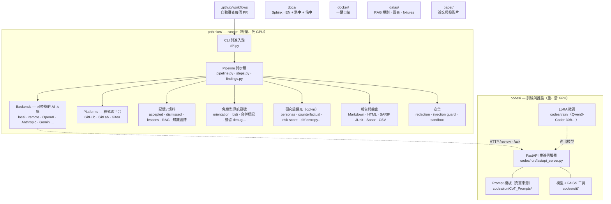

# prthinker

[English](../README.md) · **繁體中文** · [简体中文](README.zh-CN.md)

📖 **線上文件：** <https://code-review-framework.readthedocs.io/en/latest/>

> 為 GitHub Pull Request 設計的思維鏈（Chain-of-Thought）程式碼審查框架，
> 底層由微調後的 Qwen3-Coder 模型加上檢索增強（RAG）提示驅動。

`prthinker` 會讀取 PR diff、執行五步思維鏈審查、把結構化的總結與一鍵套用的
`suggestion` 區塊回貼到 PR。它會從每個 repo 的歷史中學習──被 PR 作者拒絕的留言
下次會被過濾掉，被採納的建議會以前例（exemplar）的形式注入下一輪 prompt──
並且可以充當合併前的必要狀態檢查。

## 一句話說明（給所有人）

沒碰過程式碼也沒關係，整個概念用幾句話就能講完：

- **它做什麼**──當開發者開出一個 Pull Request（提議的程式碼變更）時，
  `prthinker` 會像一位細心的資深工程師那樣審查：摘要這次改了什麼、指出
  bug 與風險點、標出風格與設計問題，並把留言直接貼在受影響的行上──
  其中許多還附帶一鍵「套用此修正」按鈕。
- **它會學你們團隊的口味**──團隊拒絕過的留言，它不再重複；團隊採納過的
  建議，下次會被當成範例重用。
- **它能守住合併按鈕**──你可以把它設成必要檢查，讓 Pull Request 在嚴重
  問題尚未解決前無法被合併。
- **兩個半邊**──輕量的 **runner** 負責跟 GitHub 對話、不需要特殊硬體；
  較重的 **AI「大腦」**（語言模型）則跑在另一台 GPU 伺服器上，或透過
  OpenAI / Anthropic 之類的付費 API。下方 [專案結構](#專案結構) 的圖
  說明各部分如何銜接。

可以把它想成一位隨時待命、永不疲倦、記得過往回饋、並且會一步步說明推理
過程的審查員。

## 你會得到什麼

- **五步 CoT pipeline**──`first_summary` → `first_code_review` → `linter` →
  `code_smell` → `total_summary`，外加可選的逐檔 inline-findings 步驟，輸出
  結構化 JSON。
- **逐檔 inline review**，搭配 GitHub `suggestion` 區塊，PR 作者點一下即可
  套用。
- **Copilot 式 PR 摘要**──審查前的 `prthinker pr-summary` 階段讀取 PR
  標題、描述與 commit 訊息並對照 diff，upsert 一則專屬、自動更新的留言
  （`### Overview` / `### Key changes` / `### Areas to review` /
  `### Notes`），核對作者「所寫」與 diff「所做」是否一致；由 `enumerate`
  job 在較慢的逐檔審查開始前貼出，讓 reviewer 立刻有概覽。
- **全域規則 + 各 repo 規則包**：透過 `--rules-dir` 把團隊自訂的 markdown
  規則加進 prompt。
- **兩份學習語料**：`dismissed.jsonl`（用相似度過濾掉重複命中）、
  `accepted.jsonl`（把 top-K 採納過的範例注入 prompt）。
- **CI 失敗訊號**：把失敗 job 的尾端 log 前置到 diff，讓 reviewer 能對齊
  flagged 行與實際的測試失敗。
- **合併前 Check Run gate**：當出現 error 嚴重度的 finding 時讓 Check Run
  變成 failure，可在 branch protection 設成必要檢查。
- **可替換的 backend**：四種任你挑──本機 in-process Hugging Face
  causal-LM（Qwen、Llama、Mistral、CodeLlama …，支援 LoRA + 量化）、
  自架 FastAPI 推論伺服器、任何 OpenAI-Chat-Completions 相容端點
  （OpenAI、Azure、vLLM、Ollama `/v1`、LM Studio、Together、Groq、
  DeepInfra、OpenRouter …）、Anthropic Claude Messages API、或
  Gemini / Cohere / Mistral；`RouterBackend`（故障轉移）與
  `EnsembleBackend`（表決）可組合上述任一後端。

### 研究級擴充（opt-in）

十七個多數 LLM code review 系統未實作的機制。大多需搭配 `--inline-review`；
依本專案不謊造原則，我們只交付框架，量化 benchmark 數字屬未來工作。

- **對抗強健性**（`prthinker adversarial-eval`）──針對四種攻擊類型跑
  prompt-injection 語料，把每一筆呼叫結果寫入 SQLite。隨附之
  `seed.jsonl` 是種子語料，**不是** benchmark。
- **閉環多輪對話**（`--reply-to-author`）──讀取 PR 作者對上次 prthinker
  摘要評論之回覆，注入為 *Prior dialogue* 區塊。
- **反事實審查**（`--counterfactual`）──針對屬於 *設計選擇* 之 finding，
  列出競爭性實作方案與小型 trade-off 矩陣。
- **評論來源 / 引用稽核**（`--provenance`）──每條 finding 附上 `provenance`
  payload，標示引用了哪一條 RAG 規則 / accepted-example / diff 行號。
- **Force-push 差分**（`--diff-since-last`）──把每檔新側內容 hash，
  同一 PR 之下次 push 時未動的檔直接 reuse 上次 findings。
- **建議 sandbox 驗證**（`--verify-suggestions`）──把 working tree 複製到
  disposable sandbox 套用 suggestion 後跑 `--verify-cmd`，每條建議標
  `[verified]` / `[FAILED]` / `[skipped]` / `[error]`。原 repo 絕不動。
- **跨語言 API 一致性**（`--api-consistency`）──當 PR 同時碰到後端 `.py`
  與前端 `.ts` / `.tsx`，新增一個 step 偵測兩側 request/response 形狀漂移。
- **PR 類型自適應**（`--pr-classify`）──從 diff + 標題 + body 把 PR 分為
  bugfix / feature / refactor / docs / chore / unknown，後續 review 深度
  隨之調整。
- **評論一致性訊號**（`--reproducibility-check`）──同 prompt 跑兩次 inline-findings，
  把 finding 標 `[stable]` / `[low-reproducibility]`。
- **依賴升級影響**（`--dep-upgrade-check`）──偵測 lock-file 觸碰，
  抽出版本 delta，問模型 breaking change 是否影響本 repo 之實際用法。
- **多角色 + 衝突顯化**（`--personas`）──跑 N 個正交 lens（security /
  performance / readability / api_stability / maintainability），
  conflict-finder step 把它們的分歧顯化出來。
- **風險加權注意力**（`--risk-weighted`）──以 churn + complexity + bug
  history（從 `git log` 抓）算每檔風險分，按比例縮放 finding budget。
- **Diff 熵 /「Diff bomb」偵測**（`--diff-entropy`）──算 PR size +
  目錄分布 Shannon entropy；熵高時於留言頂端貼「Consider splitting this PR」警示。
- **主動學習衍生規則**（`derive-lessons` + `--lessons`）──把 dismissed /
  accepted 語料蒸餾為可重用規則，下次審查注入最近 top-K。
- **跨 PR finding 聚類**（`discover-rules`）──對累積 finding 跑貪婪
  cosine 聚類，把重複問題顯化為候選專案規則。
- **Repo 知識圖譜**（`build-kg` + `--kg-ground`）──把 repo 符號持久化至
  SQLite 並接地，使模型引用真實符號而非虛構；附 D3 視覺化，於
  `/kg/<name>/` 逐倉服務。
- **每檔遞增存檔**（`--incremental-save-dir`）──逐檔 atomic 寫盤，run
  中斷／崩潰仍留下可讀之部分結果。

**可操作性與輸出整合**（opt-in、runner-safe）：SARIF 與獨立 HTML 報告、
finding 抑制（`.prthinkerignore`）與去重、公開 API / semver 影響、Gitea
平台轉接器、commit message 審查、額外 HTTP 後端（Gemini / Cohere /
Mistral）含 `RouterBackend` 故障轉移與 `EnsembleBackend` 表決、
self-consistency 取樣、第三方 step 外掛、confidence 棄權、引用驗證、
prompt-injection 防護、finding 在地化、golden-set 快照、評估 harness
骨架、成本估算與預算，以及聚焦審查模式（security / performance /
test-coverage / IaC / DB-migration / accessibility / secret-scan / PII）。

**審查導航訊號（無需模型）**：十三個純函式檢查呈現於每則 PR 摘要下方，
亦可透過 `prthinker triage`（無 backend、瞬間、GPU-free）或 MCP `triage_diff`
工具獨立執行──Trojan-Source 雙向／不可見字元、殘留合併衝突標記、重新命名／
搬移、刪除、mode／執行位變更、lockfile／vendored／minified 雜訊、純格式變更、
二進位變更、大段貼上、覆蓋缺口、新增 TODO/FIXME 標記、殘留 debug 敘述、
吞錯 `except: pass`。

設計細節見 [`docs/zh-TW/concepts/research-extensions.rst`](../docs/zh-TW/concepts/research-extensions.rst)。

## 快速開始

```bash
# 只裝 runner 所需相依，不需要 torch / transformers
pip install -e ".[runner]"

# 對本機 diff 跑審查（指向遠端推論伺服器）
prthinker review-file my-change.diff \
    --backend remote \
    --remote-url http://my-host:9000 \
    --per-file --inline-review

# 完整審查 PR（GitHub Action 內部用的就是這個）
prthinker review-pr \
    --repo owner/name --pr-number 42 \
    --backend remote --remote-url http://my-host:9000 \
    --gate-on error --include-ci-signals

# …或透過 OpenAI-compat backend 使用 OpenAI / Azure / vLLM / Ollama
prthinker review-pr --repo o/r --pr-number 42 \
    --backend openai \
    --openai-base-url http://localhost:11434/v1 \
    --openai-model llama3.1:8b \
    --openai-api-key ollama

# …或使用 Anthropic Claude
prthinker review-pr --repo o/r --pr-number 42 \
    --backend anthropic \
    --anthropic-model claude-sonnet-4-6 \
    --anthropic-api-key "$ANTHROPIC_API_KEY"

# …或一次開啟所有研究級擴充
prthinker review-pr --repo o/r --pr-number 42 \
    --per-file --inline-review \
    --reply-to-author --counterfactual --provenance \
    --diff-since-last --verify-suggestions --api-consistency \
    --pr-classify --reproducibility-check --dep-upgrade-check \
    --personas all --risk-weighted --diff-entropy \
    --judge --self-correct

# 對 backend 做 prompt-injection 強健性壓測
prthinker adversarial-eval \
    --corpus prthinker/adversarial_corpus/seed.jsonl \
    --outcomes-path .prthinker/adversarial.sqlite \
    --backend openai --openai-model gpt-4o-mini

# 無需模型的靜態 triage──不啟動 backend、瞬間、GPU-free
git diff origin/main | prthinker triage
prthinker triage --staged --exit-nonzero-on-signal   # 便宜的合併前 gate
```

部署推論伺服器（需要 GPU 與較重的相依）：

```bash
pip install -e ".[server]"
uvicorn codes.run.fastapi_server:app --host 0.0.0.0 --port 9000
```

或使用 `docker/` compose bundle。提供兩個伺服器映像:可攜的 Qwen3-Coder-30B
部署(`docker-compose.server-qwen3-coder.yml`,如下)與本機 DGX Spark 上目前的
Gemma-4-31B-it 部署(`docker-compose.server-gemma4.yml`)。base 部署把 FastAPI
伺服器 expose 在 `:9000`;其上可再疊兩個可選 overlay:

```bash
cd docker && cp .env.example .env
docker compose -f docker-compose.server-qwen3-coder.yml up -d                                  # :9000
docker compose -f docker-compose.server-qwen3-coder.yml -f docker-compose.tls.yml up -d        # +TLS+token :443
docker compose -f docker-compose.server-qwen3-coder.yml -f docker-compose.monitoring.yml up -d # +儀表板 :9000
```

monitoring overlay 把所有東西依路徑收在 host `:9000` 之下——`/grafana/`
（Grafana，預設 `admin`/`admin`）、`/prometheus/`、`/cadvisor/`、`/kg/`
（repo knowledge-graph 頁），其餘路徑一律由 prthinker 提供。完整參考
（檔案、volume、路由 URL）：
[`docs/zh-TW/concepts/docker-platforms-report.rst`](../docs/zh-TW/concepts/docker-platforms-report.rst)。

## GitHub Actions

複製 `.github/workflows/prthinker.yml`，然後在 repo 設定兩個 secrets：

| Secret               | 用途                                |
| -------------------- | ----------------------------------- |
| `PRTHINKER_BACKEND_URL`    | FastAPI 推論伺服器的基底 URL        |
| `PRTHINKER_BACKEND_API_KEY`| Bearer token（可選）                |

workflow 在 `pull_request` opened / synchronize / reopened 時觸發，
跑三個 job：`enumerate` 列出 files（依 `PRTHINKER_EXCLUDE_GLOBS` 過濾
noise）並貼出 Copilot 式 pre-review PR 摘要，`review` 是個 matrix──每個
file 各自一個 runner + 60 分鐘 timeout，`aggregate` 合所有 partial JSON
為單一 summary comment + 一個 inline review + 開關 gate 各一次。
Runner ↔ server 走 `POST /review/submit` + `GET /review/result/{id}`
輪詢，所以即使反向 proxy 有短 idle timeout（如 Cloudflare 100 秒）也不會
撞牆。

新 commit 會取代該 PR 自己仍在跑的 run：workflow 以 PR 為單位分組
concurrency 並設 `cancel-in-progress: true`，re-push 會丟棄過時的審查而
非把它跑完。跨 PR 的 GPU 安全改由**伺服器端**保證──每次 `model.generate`
都在一道 process 級全域鎖下執行，兩個 PR 同時審查時於 GPU 上排隊而非 OOM。

Workflow 被取消時不會繼續燒 GPU──runner 離開前會 post
`POST /review/cancel/{id}`\ ；backend 的 idle sweeper 也會把 180 秒
沒被 poll 的 job 自動設成 cancel。Aggregate 之 PR-wide
`### Overall Summary` 透過 `POST /ask/submit` 跨 file 合成。
對同一 SHA 重複 run 不會累積：summary comment 就地 upsert、舊
inline review 的 child comments 全部刪掉、舊 `prthinker` check
PATCH 成 *superseded* 灰色狀態。完整架構見
[`docs/zh-TW/guide/github-actions.rst`](../docs/zh-TW/guide/github-actions.rst)。

## 文件

- **[`setup.zh-TW.md`](setup.zh-TW.md)** — 完整設置指引（六種情境、
  所有 env var、疑難排解）。
- **[`features.zh-TW.md`](features.zh-TW.md)** — 完整功能總覽。
- **[`docs/zh-TW/`](../docs/zh-TW/)** — Read-the-Docs 風格深度章節。

完整文件發佈於 Read the Docs：
**<https://code-review-framework.readthedocs.io/en/latest/>**（原始碼在
[`docs/`](../docs/)），三種語言並行維護：

- `docs/`（英文，主版本）
- `docs/zh-TW/`（繁體中文）
- `docs/zh-CN/`（简体中文）

每個版本包含：

- **Guide**──安裝、快速開始、組態、GitHub Actions
- **Concepts**──架構、pipeline、RAG、語料庫、CI 訊號與 gate
- **Reference**──CLI、HTTP API、Python API

本機建置文件：

```bash
pip install -r docs/requirements.txt
py -m sphinx -b html docs docs/_build/html
```

## 專案結構

整個 repo 分成**兩個半邊**：輕量的 **runner**（`prthinker/`──讀取 PR、
執行審查、回貼結果，不需要 GPU）與較重的 **訓練 + 推論** 側（`codes/`──
在 GPU 上跑 AI 模型）。其餘目錄（`docs/`、`docker/`、`datas/`、`paper/`、
`tests/`、GitHub Action）都是支援這兩者。



**逐目錄說明：**

```text
Code-Review-Framework/
├── prthinker/            # RUNNER — 讀 PR、做審查、回貼結果（免 GPU）
│   ├── cli*.py           #   命令列進入點（review-pr、review-file、triage…）
│   ├── pipeline.py       #   一步步的審查引擎 …
│   ├── steps.py          #   … 與各個審查步驟
│   ├── backends/         #   可替換的「AI 大腦」：本機模型、自架伺服器、OpenAI、Anthropic、Gemini…
│   ├── platforms/        #   可替換的程式碼平台：GitHub、GitLab、Gitea
│   ├── prompts/          #   隨套件捆綁的審查 prompt 模板（與 codes/ 保持同步）
│   ├── review_modes/     #   聚焦審查：security、performance、PII、IaC、accessibility…
│   ├── accepted.py       #   記憶：團隊採納過的建議（重用為範例）
│   ├── dismissed.py      #   記憶：團隊拒絕過的留言（下次過濾掉）
│   ├── *_report.py       #   輸出格式：Markdown、HTML、SARIF、JUnit、Sonar、CSV
│   ├── redaction.py      #   安全：呼叫外部 API 前先擦掉密鑰
│   ├── injection_guard.py#   安全：擋掉藏在 diff 裡的 prompt-injection 攻擊
│   └──（orientation、personas、risk_score、counterfactual…）  # 訊號 + 研究級擴充
├── codes/                # AI 大腦 — 訓練 + 推論伺服器（需要 GPU）
│   ├── run/fastapi_server.py  #   runner 呼叫的模型伺服器
│   ├── run/CoT_Prompts/       #   Prompt 模板（單一真實來源）
│   ├── train/                 #   微調腳本（Qwen3-Coder-30B、Qwen3-30B、Qwen2.5-7B…）
│   └── util/                  #   模型載入 + FAISS 檢索
├── docs/                 # 本文件（英文 + 繁體中文 + 简体中文），以 Sphinx 建置
├── docker/               # 一鍵自架（base + 可選 TLS + 監控）
├── datas/                # RAG 規則文件、架構圖、測試 fixtures
├── paper/                # 學術論文與投影片
├── tests/                # 自動化測試
└── .github/workflows/    # 自動審查每個 PR 的 GitHub Action
```

設計模式視角（Strategy / Factory / Registry / Repository）與執行期資料流
圖，請見 [`READMEs/architecture.md`](architecture.md) 與
[`docs/zh-TW/concepts/architecture.rst`](../docs/zh-TW/concepts/architecture.rst)。

## 引用

若於學術工作中使用本框架，請引用 `paper/` 下對應的論文。Read the Docs 站點
附有原始稿件連結。

## 授權

請見 [LICENSE](../LICENSE)。