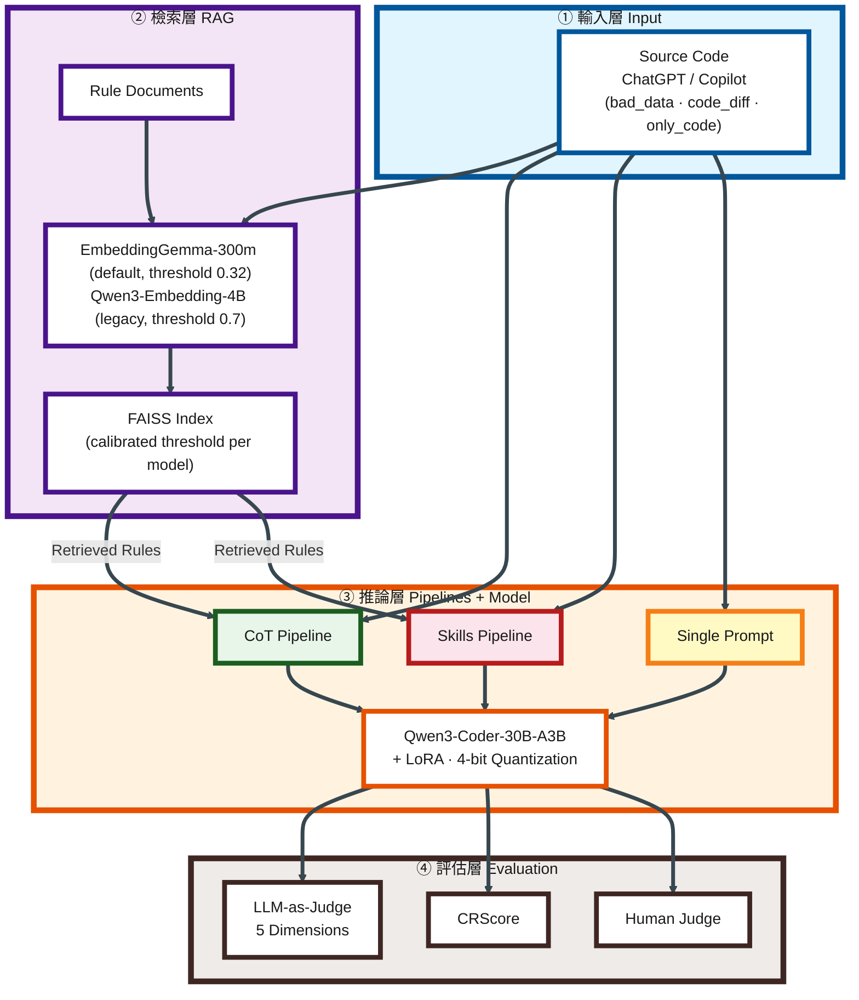
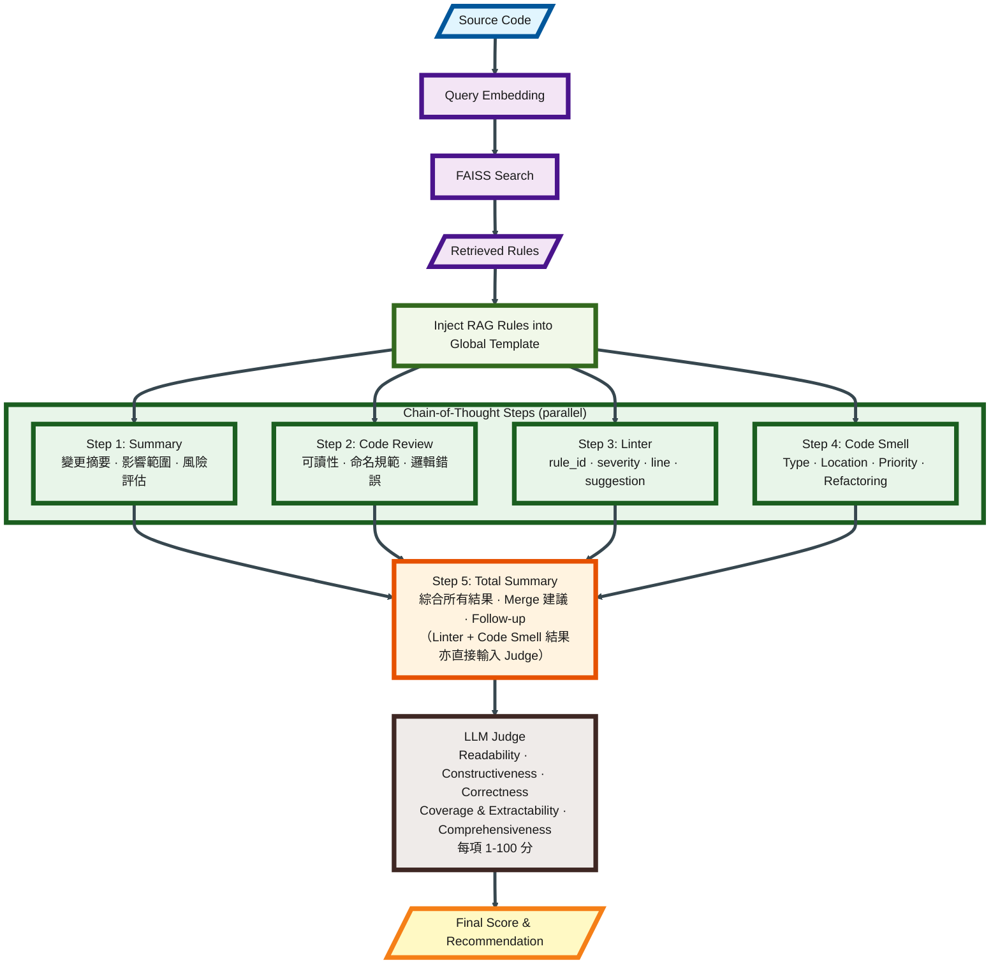
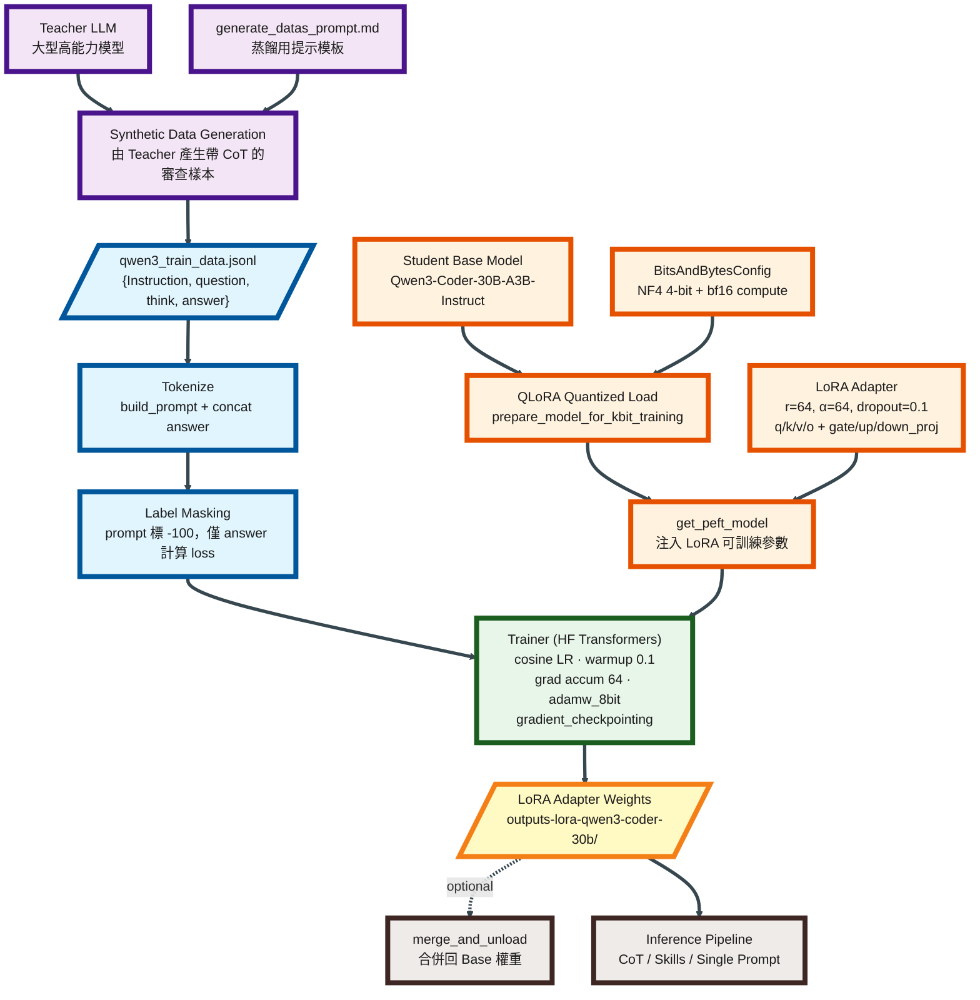
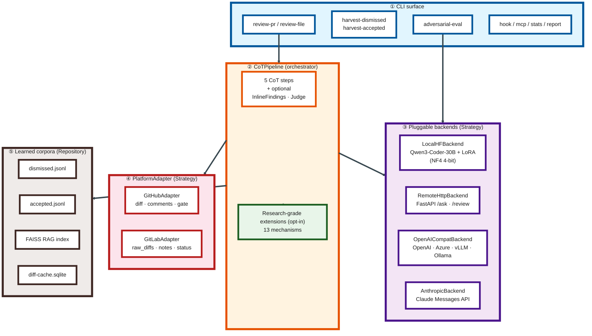

# Code Review Framework - Architecture Diagram

## System Overview



## CoT Code Review Detailed Flow



## Knowledge Distillation Training Flow



## PRThinker Runtime Architecture



## Project Directory Structure

```
Code-Review-Framework/
├── prthinker/                        # Standalone Python package
│   ├── __init__.py
│   ├── __main__.py                   # python -m prthinker
│   ├── cli.py                        # entry point: handler registry + main()
│   ├── cli_parser.py                 # argparse construction (shared + per-cmd)
│   ├── cli_review.py                 # review-file / review-pr handlers
│   ├── cli_commands.py               # corpora / KG / maintenance handlers
│   ├── config.py                     # dataclass-based runtime config
│   ├── pipeline.py                   # CoTPipeline orchestrator
│   ├── steps.py                      # ReviewStep ABC + 5 registered steps
│   ├── schemas.py                    # Pydantic v2 wire-format models
│   ├── findings.py                   # JSON-array parser + sanitizer
│   ├── formatters.py                 # Markdown PR-comment renderer
│   ├── rag.py                        # RAGRetriever abstractions
│   ├── rules.py                      # per-repo rule loader
│   ├── repo_config.py                # .prthinker.yaml parser
│   ├── checks.py                     # GitHub Check Run gate
│   ├── ci_signals.py                 # Failed-job log integration
│   ├── github_api.py                 # raw GH REST helpers
│   ├── platforms/                    # PlatformAdapter (Strategy)
│   │   ├── base.py
│   │   ├── github.py
│   │   └── gitlab.py
│   ├── backends/                     # InferenceBackend (Strategy)
│   │   ├── base.py
│   │   ├── local.py                  # LocalHFBackend (Qwen + LoRA)
│   │   ├── remote.py                 # RemoteHttpBackend
│   │   ├── openai_compat.py
│   │   ├── anthropic.py
│   │   └── wrappers.py               # cache + telemetry wrappers
│   ├── accepted.py                   # AcceptedExamplesStore + Retriever
│   ├── dismissed.py                  # DismissedFilter
│   ├── harvest.py                    # harvest-dismissed / harvest-accepted
│   ├── cache.py                      # SQLite prompt cache
│   ├── telemetry.py                  # per-call token / latency / cost
│   ├── pricing.py                    # backend → $/Mtok table
│   ├── report.py                     # cross-store longitudinal report
│   ├── redaction.py                  # secret-pattern scrubber
│   ├── mcp_server.py                 # MCP stdio integration
│   ├── auto_fix.py                   # apply suggestions + open fix PR
│   ├── self_review.py                # second-pass noise filter
│   ├── judge.py                      # per-file verdict aggregation
│   ├── dialogue.py                   # --reply-to-author harvesting
│   ├── counterfactual.py             # mutation-style review parser
│   ├── adversarial.py                # prompt-injection bypass detection
│   ├── adversarial_eval.py           # adversarial-eval subcommand
│   ├── adversarial_corpus/           # Seed JSONL + README
│   ├── review_cache.py               # Force-push differential cache
│   ├── sandbox.py                    # --verify-suggestions sandbox
│   ├── api_consistency.py            # Cross-language drift step
│   ├── pr_classifier.py              # PR-type adaptive review
│   ├── reproducibility.py            # Reviewer disagreement signal
│   ├── dep_upgrade.py                # Dependency-upgrade impact
│   ├── personas.py                   # Reviewer-personas + conflict
│   ├── risk_score.py                 # Per-file risk scorer
│   └── diff_entropy.py               # Diff-bomb detector
├── tests/                            # ~274 pytest cases
├── codes/                            # Research / training scripts (legacy)
│   ├── run/                          #   cot.py / skills.py / fastapi_server.py
│   ├── train/                        #   LoRA fine-tuning entry points
│   └── util/                         #   hf_model_util.py + faiss_util.py + server_metrics.py
├── datas/                            # RAG rules + experiment fixtures
├── docs/                             # Sphinx (en + zh-TW + zh-CN, single tree)
├── docker/                           # Self-host: Dockerfile + compose (port 9000)
├── paper/                            # Manuscript + pptxgenjs slide build
├── .github/workflows/prthinker.yml   # GHA: review-pr with graceful skip
├── .prospector.yaml                  # D213 disabled, D212 selected
├── pyproject.toml                    # [tool.bandit] + [tool.pydocstyle]
└── READMEs/
    ├── CLAUDE.md                     # Project guidelines (this file's neighbour)
    ├── README.zh-TW.md / README.zh-CN.md
    ├── setup.{md,zh-TW.md,zh-CN.md}
    ├── features.{md,zh-TW.md,zh-CN.md}
    ├── architecture.md               # This file
    └── Human_Judge.md                # Human evaluation guide
```
