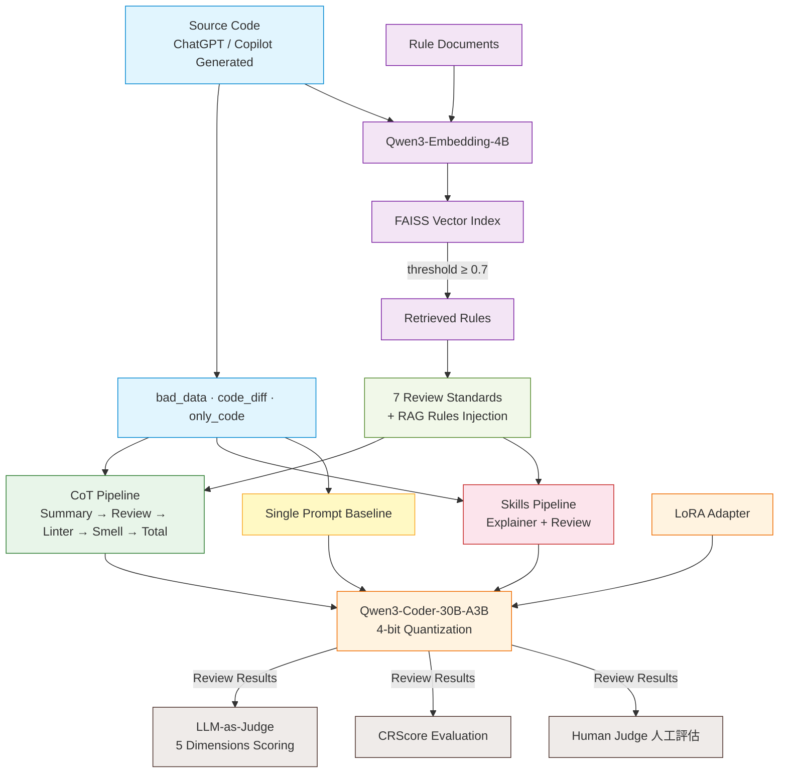
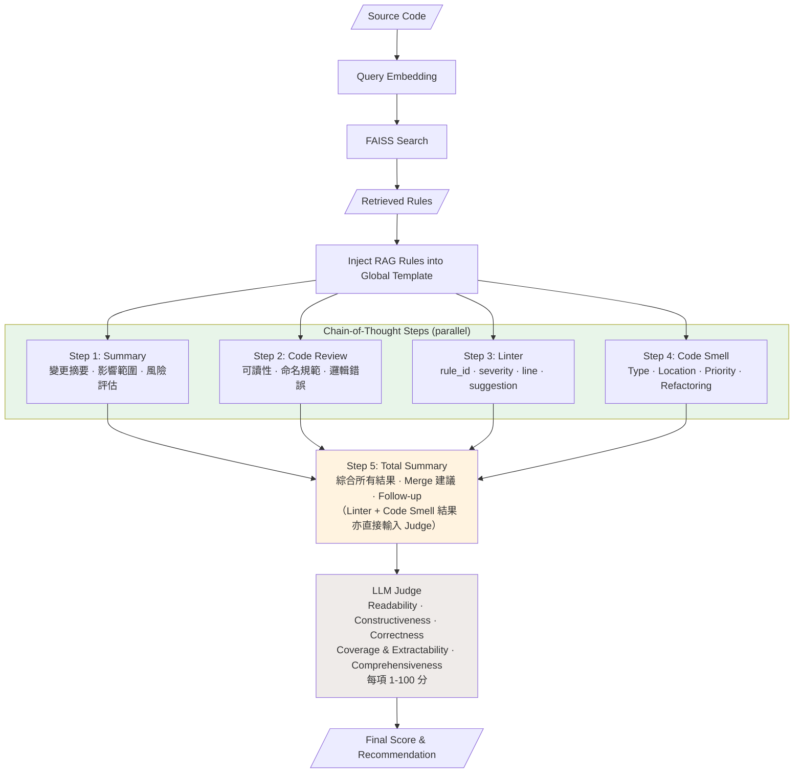
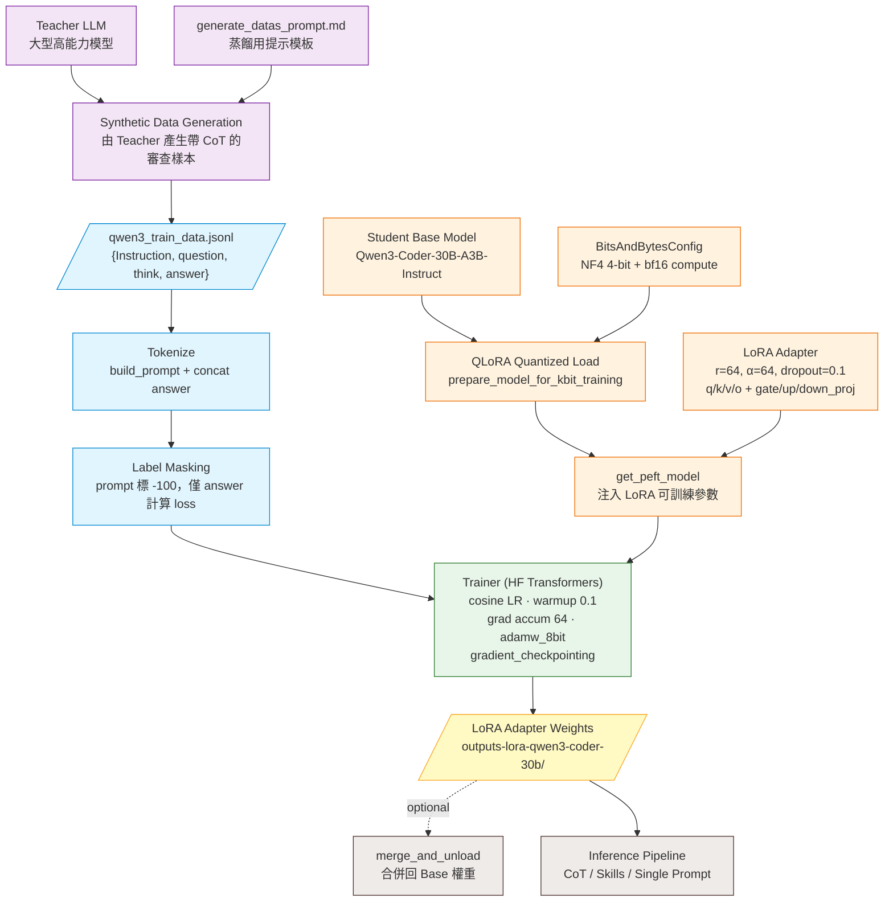

# Code Review Framework - Architecture Diagram

## System Overview



## CoT Code Review Detailed Flow



## Knowledge Distillation Training Flow



## Project Directory Structure

```
Code-Review-Framework/
├── codes/
│   ├── run/                          # Main Execution
│   │   ├── cot.py                    # CoT Pipeline Entry Point
│   │   ├── skills.py                 # Skills Pipeline Entry Point
│   │   ├── single_prompt.py          # Single Prompt Baseline
│   │   ├── run_single_prompt.py      # Single Prompt Runner
│   │   ├── fastapi_server.py         # FastAPI /ask Endpoint
│   │   ├── ask_functions.py          # RAG Query Helper
│   │   ├── build_our_llm_judge.py    # Build Judge Prompts
│   │   ├── build_our_llm_judge_single_prompt.py
│   │   ├── build_crscore_llm_judge.py
│   │   ├── CoT_Prompts/             # CoT Prompt Templates
│   │   │   ├── global_rule.py        #   Global Review Rules + RAG Injection
│   │   │   ├── first_summary_prompt.py  # PR Summary
│   │   │   ├── first_code_review.py  #   Initial Review
│   │   │   ├── linter.py            #   Linter Analysis
│   │   │   ├── code_smell_detector.py # Code Smell Detection
│   │   │   ├── step_by_step_analysis.py # Step-by-Step Analysis
│   │   │   ├── total_summary.py      #   Final Synthesis
│   │   │   ├── judge.py             #   LLM Judge Template (5 dims)
│   │   │   └── CRSCORE/             #   CRScore Evaluation
│   │   └── Skills/                  # Skills Prompt Templates
│   │       ├── code_review.py        #   Direct Review
│   │       └── code_explainer.py     #   Code Explanation
│   ├── train/                        # Model Training (LoRA)
│   │   ├── qwen3-coder-30b.py
│   │   ├── qwen3-30b.py
│   │   ├── qwen2.5-7b.py
│   │   └── qwen3.1-7b.py
│   ├── util/                         # Utilities
│   │   ├── qwen3_util.py            #   Model Loading + Inference
│   │   ├── faiss_util.py            #   FAISS RAG Engine
│   │   ├── memory.py                #   Memory Utils
│   │   └── prompt_define.py
│   └── base_model_*/                # Baseline Experiments
│       ├── with_vector_database/     #   With RAG
│       └── without_vector_database/  #   Without RAG
├── datas/
│   ├── code_to_detect/              # Test Data
│   │   ├── bad_data/                #   Known Bad Code
│   │   ├── code_diff/               #   Code Diffs
│   │   └── only_code/               #   Source Code Only
│   ├── RAG_data/rag_data.py         # RAG Rule Documents
│   └── Prompts/                     # Prompt Copies
└── Human_Judge.md                   # Human Evaluation Guide
```
